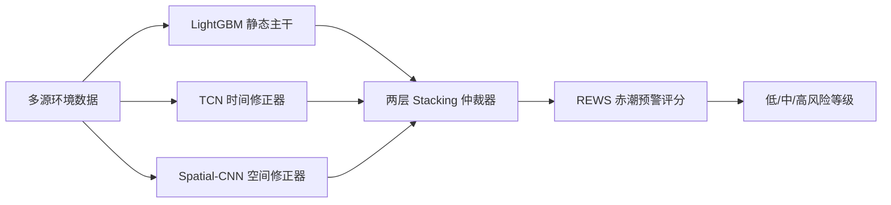

# 数据与模型口径说明

本文档说明 WebRedRisk 网站与论文中数据、模型和预警评分体系之间的对应关系，避免出现“网站展示”和“论文表述”不一致的问题。

## 1. 数据范围

系统展示的数据来自东海长江入海口及邻近海域赤潮风险评估项目。

| 项目 | 口径 |
|---|---|
| 研究海域 | 120.5°E--123.5°E，29.0°N--32.5°N |
| 时间范围 | 2004 年 1 月至 2023 年 12 月 |
| 空间分辨率 | 0.25° × 0.25° |
| 网格数量 | 195 个 |
| 样本数量 | 46,800 条 |
| 时间粒度 | 月尺度 |
| 数据格式 | 前端 JSON 静态文件 |

## 2. 数据来源

系统展示的数据对应论文中的多源数据整合部分，主要包括：

| 数据类别 | 变量 | 用途 |
|---|---|---|
| 海洋物理环境 | 海表温度、盐度 | 刻画水文背景 |
| 海洋生态指标 | 叶绿素 a | 表征浮游植物生物量 |
| 气象条件 | 风速、气压、太阳辐射、降水 | 刻画外部气象驱动 |
| 营养盐 | 硝酸盐、磷酸盐、硅酸盐 | 表征藻类生长资源 |
| 赤潮事件 | 发生标签、面积、优势种、毒性 | 构建标签与风险解释 |

## 3. 标签口径

论文强调空间分辨标签的重要性：赤潮事件不应简单扩展为“整个研究区同月均为赤潮”，而应尽量保留事件位置、影响范围和空间异质性。

网站承担的是展示层职责，其数据文件中保留了经纬度、网格、月份、赤潮标签、面积和优势种等字段，用于支持：

- 风险地图的空间展示；
- 数据处理页面的样本追溯；
- 时间序列页面的月尺度统计；
- 分析报告中的数据说明。

## 4. 模型体系

论文中的模型体系为：

各模型职责如下：

| 模型 | 职责 | 网站体现 |
|---|---|---|
| LightGBM | 学习环境因子与赤潮发生之间的静态非线性关系 | 特征分析、模型评估 |
| TCN | 捕捉 12 个月环境序列中的时间演化模式 | 未来趋势、模型评估 |
| Spatial-CNN | 捕捉环境变量在空间上的异常纹理和斑块结构 | 风险地图、模型评估 |
| Stacking | 融合三类专家模型输出，形成最终风险判断 | 风险预测、模型评估、分析报告 |

## 5. REWS 预警评分

REWS 即 Red Tide Early Warning Score，是论文中定义的赤潮预警评分，用于将模型概率输出转化为业务可理解的预警等级。

网站中风险等级展示遵循同一思想：

| 风险等级 | 含义 | 建议 |
|---|---|---|
| 低风险 | 环境条件整体不利于赤潮暴发 | 保持常规监测 |
| 中风险 | 部分环境因子进入敏感区间 | 提高监测频率，关注关键指标 |
| 高风险 | 多个关键因子共同指向赤潮风险升高 | 启动重点巡查与预警响应 |

## 6. 网站与论文章节对应

| 论文章节/内容 | 网站模块 |
|---|---|
| 多源数据搜集与整合 | 数据处理、项目总览 |
| 数据预处理与描述性统计 | 数据处理、相关分析 |
| LightGBM 空间分辨分类模型 | 特征分析、模型评估 |
| TCN 时序修正模型 | 未来趋势、模型评估 |
| Spatial-CNN 空间格局检测 | 风险地图、模型评估 |
| LightGBM-TCN-CNN 两层融合 | 模型评估、风险预测 |
| 可视化预警网站与应用价值分析 | 项目总览、分析报告、风险地图 |

## 7. 当前展示版边界

为保证系统易部署、易复现，当前 WebRedRisk 采用静态数据展示方式。也就是说：

- 网站可以展示模型结果、风险分布、趋势和解释；
- 网站可以通过前端规则进行交互式风险评分演示；
- 网站不依赖在线数据库；
- 网站当前不在服务器端实时重新训练模型；
- 如果未来需要实时预测，可增加 FastAPI 后端服务接入训练好的模型文件。

这一设计适合比赛展示和服务器部署，能够清楚体现项目工作量，同时避免服务器环境过重。
