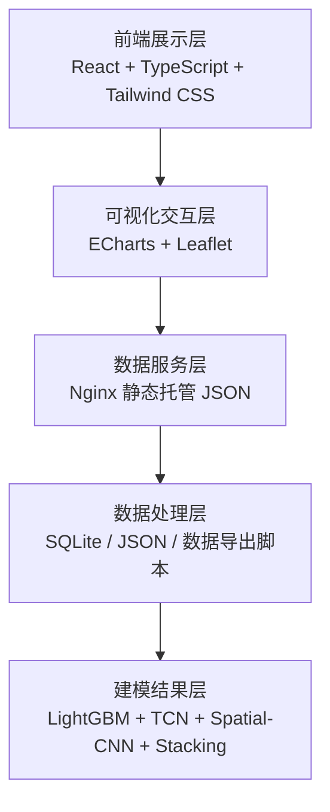
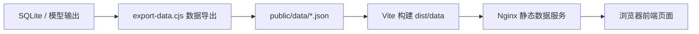
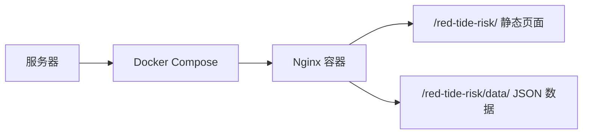

# 系统架构与功能说明

## 1. 系统总体架构

WebRedRisk 采用“前端交互展示 + 静态数据服务 + 离线建模管线 + 容器化部署”的轻量化架构。与传统需要数据库和后端接口长期运行的系统不同，本项目将建模结果、空间网格、时间序列和统计结果预处理为 JSON 文件，由 Nginx 作为静态数据服务端统一托管。这样既能满足竞赛展示的完整性，也便于服务器快速部署。

系统可划分为五层：



各层职责如下：

| 层级 | 职责 |
|---|---|
| 前端展示层 | 负责页面布局、路由切换、用户交互和状态展示 |
| 可视化交互层 | 负责地图、折线图、柱状图、雷达图、相关矩阵等可视化 |
| 数据服务层 | 由 Nginx 托管 `dist/` 和 `data/*.json`，向浏览器提供静态资源 |
| 数据处理层 | 将 SQLite 数据库、模型结果和统计结果整理为前端可读 JSON |
| 建模结果层 | 对应论文中的 LightGBM、TCN、Spatial-CNN 与两层 Stacking 融合模型 |

## 2. 前端架构

前端基于 React 19、TypeScript 和 Vite 构建，采用单页应用结构。系统使用 `HashRouter` 组织页面路由，便于部署在 `/red-tide-risk/` 子路径下，也避免服务器刷新页面时出现路由 404。

前端核心目录为：

```text
src/
├── components/       # 复用组件
├── pages/            # 业务页面
├── services/         # 数据上下文与数据加载
├── types/            # TypeScript 类型定义
├── utils/            # 风险评分等工具函数
├── App.tsx           # 路由入口
└── main.tsx          # 应用入口
```

### 2.1 页面组织

系统不是简单堆叠页面，而是围绕赤潮业务链条组织为 11 个功能模块：

```text
项目总览 -> 数据处理 -> 风险地图 -> 风险预测 -> 模型评估
        -> 预测对比 -> 未来趋势 -> 特征分析 -> 分析报告
        -> 相关分析 -> 数据导入
```

这种组织方式对应“数据-模型-预警-解释-报告”的完整流程，使评审或业务用户能够从原始数据概况一路追溯到模型判断和应用价值。

### 2.2 组件设计

通用组件主要包括：

| 组件 | 作用 |
|---|---|
| `Layout` | 页面整体布局，组织侧边栏和主内容区 |
| `Sidebar` | 系统导航，连接 11 个功能模块 |
| `ChartCard` | 图表容器，统一标题、边距和视觉风格 |
| `StatCard` | 指标卡片，展示样本数、网格数、风险数量等 |
| `RiskBadge` | 风险等级标签，统一低/中/高风险的视觉表达 |

### 2.3 状态与数据加载

前端通过 `DataProvider` 建立统一数据上下文。页面不直接散乱读取文件，而是通过统一上下文获取以下数据：

- `stats.json`：样本总量、时间范围、空间范围、年度/月度统计
- `geo_data.json`：空间网格及风险分布
- `time_series.json`：逐月时间序列
- `feature_importance.json`：特征重要性
- `correlation.json`：环境因子相关矩阵
- `samples_index.json` 与 `samples_0001.json` 等分页样本

这种设计相当于前端内部的数据服务层，减少页面之间重复请求和重复处理。

## 3. 后端与数据服务架构

### 3.1 当前后端形态

本项目当前采用静态后端架构：



也就是说，系统不需要服务器长期运行 Python、FastAPI 或数据库服务。所有前端需要的数据都已经预处理为 JSON 文件，部署时由 Nginx 直接返回。

这种设计有三个优点：

1. 部署简单：服务器只需 Docker/Nginx。
2. 稳定性高：没有数据库连接池、后端进程崩溃等问题。
3. 适合竞赛展示：所有数据随项目一起交付，评审可快速复现。

### 3.2 后端组成

虽然没有传统 API 服务，但系统仍然具有清晰的后端职责：

| 后端组成 | 对应文件/目录 | 职责 |
|---|---|---|
| 数据导出脚本 | `scripts/export-data.cjs` | 将数据库或模型结果导出为 JSON |
| 静态数据目录 | `public/data/`、`dist/data/` | 存放前端可直接加载的数据 |
| 生产 Web 服务 | `nginx/default.conf` | 托管页面、数据和静态资源 |
| 容器部署配置 | `Dockerfile`、`docker-compose.yml` | 提供服务器部署入口 |

如果后续需要接入实时预测，可以在此基础上增加 FastAPI 或 Flask 服务，但当前竞赛展示版以静态数据服务为主，已经满足论文结果展示、可视化预警和服务器部署需求。

## 4. 数据组织

数据文件以 JSON 形式组织，主要位于：

```text
public/data/
dist/data/
```

核心数据包括：

| 文件 | 内容 |
|---|---|
| `stats.json` | 总样本数、赤潮样本数、空间范围、时间范围、年度/月度统计 |
| `geo_data.json` | 每个网格的经纬度、风险评分、样本数量和风险等级 |
| `time_series.json` | 2004--2023 年逐月环境因子与赤潮指标 |
| `samples_index.json` | 分页样本索引，共 46,800 条样本 |
| `samples_0001.json` 等 | 分页后的原始样本数据 |
| `feature_importance.json` | 模型特征重要性 |
| `correlation.json` | 环境变量相关矩阵 |
| `organisms.json` | 赤潮优势种信息 |

## 5. 核心功能模块

### 5.1 项目总览模块

项目总览负责提供系统入口视角，集中展示研究区范围、样本总量、赤潮样本比例、监测网格数量、时间跨度和风险概况。该模块相当于系统驾驶舱，让用户快速理解项目规模和数据基础。

### 5.2 数据处理模块

数据处理模块用于展示样本字段、分页数据和数据清洗结果。由于样本总量达到 46,800 条，系统采用分页加载方式，避免一次性加载过多数据影响前端性能。

### 5.3 风险地图模块

风险地图模块基于 Leaflet 展示东海研究区网格风险空间分布。每个网格对应一个空间单元，系统根据风险评分和样本统计结果展示不同风险等级，使用户能够直观看到高风险区域的空间位置。

### 5.4 风险预测模块

风险预测模块允许用户输入环境因子，系统根据内置风险评分逻辑输出风险分数、风险等级、主要影响因子和建议措施。该模块用于解释模型如何从环境变量映射到风险判断。

### 5.5 模型评估模块

模型评估模块展示 LightGBM、TCN、Spatial-CNN 和两层 Stacking 融合模型的对比结果，强调不同模型分别承担“静态主干识别”“时间动态修正”“空间格局修正”和“融合仲裁”的作用。

### 5.6 预测对比模块

预测对比模块用于比较不同变量与风险结果之间的关系，帮助用户观察叶绿素、温度、盐度、营养盐等指标与赤潮风险的对应变化。

### 5.7 未来趋势模块

未来趋势模块主要展示历史时序趋势和季节性变化，用于辅助理解赤潮高发月份、环境因子周期性和风险随时间变化的规律。

### 5.8 特征分析模块

特征分析模块展示模型特征重要性和关键环境因子。该模块对应论文中 SHAP/特征贡献分析部分，用于解释哪些环境变量对赤潮风险判断贡献较大。

### 5.9 分析报告模块

分析报告模块将数据概况、模型输出、风险判断和解释结论整合为可汇报页面，适合比赛展示、老师检查和项目答辩。

### 5.10 相关分析模块

相关分析模块展示环境因子之间的相关关系，帮助理解变量共线性、正负相关模式和多源环境因子的耦合关系。

### 5.11 数据导入模块

数据导入模块支持 CSV/JSON 数据解析，可用于扩展样本展示或测试系统对外部数据的接入能力。

## 6. 部署架构

生产环境推荐使用 Docker Compose：



默认访问路径为：

```text
http://服务器IP:8080/red-tide-risk/
```

如需绑定域名或使用 80 端口，只需调整 `docker-compose.yml` 的端口映射或在外层 Nginx 中做反向代理。

## 7. 系统特点

1. 论文口径一致：围绕 LightGBM+TCN+CNN 两层融合模型和 REWS 预警评分组织展示。
2. 部署成本低：静态站点即可运行，不依赖在线数据库。
3. 数据可追溯：所有展示数据来自项目整理后的 JSON 文件。
4. 模块完整：覆盖数据、地图、预测、模型、解释和报告。
5. 易于扩展：后续可增加 FastAPI 实时预测服务或接入在线数据源。
